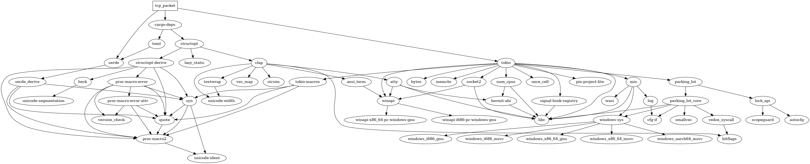

## This program is meant to demostrate the structure of a TCP Packet

It contains 2 parts:

1. Public module[lib.rs] - defines a TCP header struct & a Format trait.

2. Main module[main.rs] - populates the structure with default zero values(0) & uses an unsafe primitive to convert the struct to bytes for transfer.

I wanted to see if I could fully utilize the standard library before depending on 3rd party crates.

Dependencies,code left in but unused are: serde for future improvements.

More will be added overtime.

Ideas:
1. Re-convert bytes to string
2. Encode - Decode
3. Encryption - TCP uses TLS Encryption

Corrections & improvments
1. Change Option type to bool.
